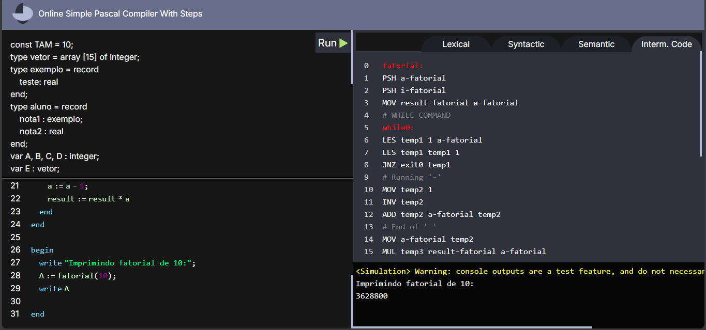

# Servidor Front End - Simple Pascal Compiler

Uma ferramenta online para visualização de etapas de compilação para a linguagem fictícia Simple Pascal.

Esse repositório diz respeito ao <u>front end</u>.

Para rodar, inicie primeiro o [back end](https://github.com/guirque/SimplePascalCompiler).

